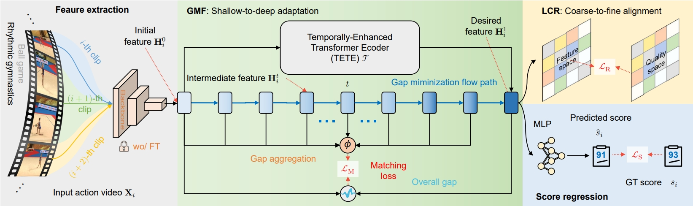

<div align="center">
  <div>
    <h1>
        PHI: Bridging Domain Shift in Long-Term Action Quality Assessment via Progressive Hierarchical Instruction
    </h1>
  </div>
  <div>
  Accepted by TIP 2025 | <a href="">arXiv</a>
  </div>
  <br/>
</div>

PHI is the implementation for Action Quality Assessment (AQA) based on the paper "PHI: Bridging Domain Shift in Long-Term Action Quality Assessment via Progressive Hierarchical Instruction".

## Framework



Our PHI framework addresses the domain shift issue through two crucial processes. Firstly, Gap Minimization Flow (GMF) progressively transforms the initial feature into the desired one, minimizing the domain gap. Secondly, List-wise Contrastive Regularization (LCR) guides the model towards subtle variations in actions, facilitating the transition from coarse to fine-grained features crucial for AQA. Finally, the refined feature is used to predict the quality score through an MLP.

## Datasets

Here are the instructions for obtaining the features and videos for the Rhythmic Gymnastics and Fis-V datasets used in our experiments:

For VST features:

- The VST features and label files of Rhythmic Gymnastics and Fis-V datasets can be download from the [GDLT](https://github.com/xuangch/CVPR22_GDLT) repository.

For I3D features:

- The I3D features and label files for both datasets will be released soon.

For Rhythmic Gymnastics videos:

- Download the videos from the [ACTION-NET](https://github.com/qinghuannn/ACTION-NET?tab=readme-ov-file) repository.

For Fis-V videos:

- Download the videos from the [MS_LSTM](https://github.com/chmxu/MS_LSTM) repository.

Please use the above public repositories to obtain the features and videos needed to reproduce our results. Let us know if you need any clarification or have trouble accessing the data.

After downloading the Rhythmic Gymnastics dataset features and videos from the referenced repositories, preprocess the data by using `rg_swinx.py`.

```bash
# Choose different head to extract features like load_model or load_model_I3d
data_path = '/{project path}/data'

orig_save = '/{project path}/data/swintx_orig_fps25_clip{}'.format(clip_len)
pool_save = '/{project path}/data/swintx_avg_fps25_clip{}'.format(clip_len)

# Command
python rg_swintx.py
```

## Installation

To get started, you will need to first clone this project and then install the required dependencies.

### Environments

- RTX3090
- CUDA: 11.1
- Python: 3.8+
- PyTorch: 1.10.1+cu111

### Basic packages

Install the required packages:

```bash
pip install -r requirements.txt
```

This will install all the required packages listed in the `requirements.txt` file.

## Training from scratch

Using the following command to train the model:

```bash
CUDA_VISIBLE_DEVICES=${gpu} python main.py \
    --video-path ${path}/swintx_avg_fps25_clip32 \
    --train-label-path ${path}/train.txt \
    --test-label-path ${path}/test.txt  \
    --model-name phi \
    --action-type Ball \
    --lr 1e-2 --epoch 200 \
    --n_encoder 1 --n_decoder 2 --n_query 4 --alpha 1 --margin 1 --lr-decay cos --decay-rate 1e-2 --dropout 0.3 \
    --loss_align 1 --activate-type 2 --n_head 1 --hidden_dim 256 --beta 0.01 --flow_hidden_dim 256
```

## Testing

Using the following command to test the model:

```bash
CUDA_VISIBLE_DEVICES=${gpu} python main.py \
    --video-path ${path}/swintx_avg_fps25_clip32 \
    --train-label-path ${path}/train.txt \
    --test-label-path ${path}/test.txt  \
    --model-name phi \
    --action-type Ball \
    --lr 1e-2 --epoch 200 \
    --n_encoder 1 --n_decoder 2 --n_query 4 --alpha 1 --margin 1 --lr-decay cos --decay-rate 1e-2 --dropout 0.3 \
    --loss_align 1 --activate-type 2 --n_head 1 --hidden_dim 256 --beta 0.01 --flow_hidden_dim 256 \
    --test --ckpt {your model saving path}/best.pkl
```

## Reproduction Example

We provide a complete example to reproduce our results on the Ball (RG) dataset. The corresponding bash script, `train_vst_rg_ball.sh`, utilizes a two-stage training approach.

From the training logs, we observe that the best Spearman's Rank Correlation Coefficient (SRCC) achieved is higher than the result reported in our paper. Additionally, it is possible to select a result that strikes a balance between SRCC and precision metric (RL2), depending on the specific requirements of your application.

## Acknowledgements

This repository is built upon the CoFInAl framework. If you have any questions or need further assistance with the code, please feel free to reach out. Thank you for your interest and support!
